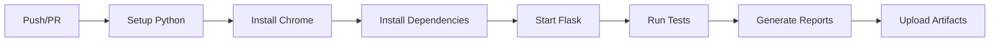

# 🚀 Projeto de Testes End-to-End com Selenium e Python

[](https://github.com/Rychardsson/projeto_selenium/actions/workflows/ci.yml)
[](https://python.org)
[](https://selenium.dev)
[](LICENSE)

> Projeto completo de automação de testes end-to-end usando Selenium, Pytest e as melhores práticas da indústria.

## ✨ Características

- 🏗️ **Page Object Model** - Estrutura organizada e reutilizável
- 🔧 **Data Factory** - Geração dinâmica de dados de teste
- 📊 **Relatórios HTML** - Documentação detalhada dos resultados
- 🚀 **CI/CD integrado** - GitHub Actions configurado
- 📸 **Screenshots automáticos** - Captura de falhas
- 🌐 **Multi-browser** - Suporte a Chrome e Firefox
- ⚡ **Execução paralela** - Otimização de performance

## 🛠️ Stack Tecnológica

| Tecnologia        | Versão | Descrição                  |
| ----------------- | ------ | -------------------------- |
| Python            | 3.9+   | Linguagem principal        |
| Flask             | 3.0+   | Framework web da aplicação |
| Selenium          | 4.20+  | Automação de navegadores   |
| Pytest            | 8.0+   | Framework de testes        |
| WebDriver Manager | 4.0+   | Gerenciamento de drivers   |

## � Estrutura do Projeto

```
projeto-testes-selenium-python/
├── 🌐 app.py                    # Aplicação Flask de exemplo
├── 📄 requirements.txt          # Dependências do projeto
├── ⚙️ pytest.ini              # Configurações do Pytest
├── 🔧 .env.example             # Variáveis de ambiente
├──
├── 📂 config/                  # Configurações centralizadas
│   └── settings.py
├──
├── 📂 pages/                   # Page Object Model
│   ├── base_page.py           # Classe base
│   ├── home_page.py           # Página inicial
│   ├── form_page.py           # Página do formulário
│   └── success_page.py        # Página de sucesso
├──
├── 📂 tests/                   # Suíte de testes
│   ├── conftest.py            # Fixtures e configurações
│   ├── test_navigation.py     # Testes de navegação
│   ├── test_forms.py          # Testes de formulários
│   └── test_errors.py         # Testes de validação
├──
├── 📂 utils/                   # Utilitários
│   ├── data_factory.py        # Geração de dados
│   └── helpers.py             # Funções auxiliares
├──
├── 📂 templates/               # Templates da aplicação
├── 📂 reports/                 # Relatórios gerados
├── 📂 screenshots/             # Screenshots de falhas
└── 📂 logs/                    # Logs de execução
```

## 🚀 Início Rápido

### 1️⃣ Pré-requisitos

- [Python 3.9+](https://python.org/downloads/)
- [Git](https://git-scm.com/)
- [Google Chrome](https://www.google.com/chrome/) ou [Firefox](https://www.mozilla.org/firefox/)

### 2️⃣ Instalação

```bash
# Clonar repositório
git clone https://github.com/Rychardsson/projeto-testes-selenium-python.git
cd projeto-testes-selenium-python

# Criar ambiente virtual
python -m venv venv

# Ativar ambiente virtual
# Windows
.\venv\Scripts\Activate.ps1
# Linux/macOS
source venv/bin/activate

# Instalar dependências
pip install -r requirements.txt
```

### 3️⃣ Configuração

```bash
# Copiar arquivo de configuração
cp .env.example .env

# Editar configurações (opcional)
# BASE_URL=http://127.0.0.1:5001
# BROWSER=chrome
# HEADLESS=false
```

### 4️⃣ Execução

**Terminal 1 - Aplicação Flask:**

```bash
python app.py
```

**Terminal 2 - Testes:**

```bash
# Todos os testes
pytest -v

# Testes específicos
pytest -v -m "smoke"           # Testes rápidos
pytest -v -m "critical"        # Testes críticos
pytest -v tests/test_forms.py  # Arquivo específico

# Com relatório HTML
pytest -v --html=reports/report.html --self-contained-html
```

## 🧪 Comandos de Teste

| Comando                       | Descrição                  |
| ----------------------------- | -------------------------- |
| `pytest -v`                   | Executar todos os testes   |
| `pytest -v -m "smoke"`        | Testes de fumaça (rápidos) |
| `pytest -v -m "critical"`     | Testes críticos            |
| `pytest -v --browser=firefox` | Usar Firefox               |
| `pytest -v --headless`        | Modo sem interface         |
| `pytest -v --lf`              | Apenas testes que falharam |
| `pytest -v -x`                | Parar na primeira falha    |
| `pytest -v -s --pdb`          | Debug interativo           |

## 📊 Tipos de Teste

### 🔍 Marcadores (Markers)

- `@pytest.mark.smoke` - Testes básicos e rápidos
- `@pytest.mark.critical` - Funcionalidades essenciais
- `@pytest.mark.regression` - Testes completos
- `@pytest.mark.slow` - Testes demorados

### � Casos de Teste

#### 🧭 Navegação (`test_navigation.py`)

- Carregamento da página inicial
- Navegação entre páginas
- Validação de títulos e URLs

#### � Formulários (`test_forms.py`)

- Preenchimento e envio
- Validação de campos
- Cenários de sucesso

#### ⚠️ Validações (`test_errors.py`)

- Campos obrigatórios
- Mensagens de erro
- Tratamento de falhas

## � Page Object Model

```python
# Exemplo de uso
from pages.home_page import HomePage
from pages.form_page import FormPage

def test_form_submission(driver):
    home = HomePage(driver)
    form = FormPage(driver)

    home.navigate()
    home.click_form_link()

    form.fill_form_and_submit("João Silva", "joao@teste.com")
    assert form.has_success_message()
```

## 🔧 Data Factory

```python
# Geração de dados dinâmicos
from utils.data_factory import DataFactory

def test_with_random_data(driver):
    user_data = DataFactory.generate_valid_user_data()
    # user_data = {"name": "Maria Santos", "email": "maria@example.com"}
```

## 🚀 CI/CD - GitHub Actions

### ✅ Status Atual: **FUNCIONANDO**

- ⚡ **Tempo de execução**: ~1 minuto
- 🎯 **Cobertura**: Testes smoke, críticos e completos
- 📊 **Artifacts**: Relatórios HTML e screenshots
- 🔄 **Triggers**: Push e Pull Request

### � Workflow



### � Monitoramento

1. Acesse **Actions** no GitHub
2. Visualize logs em tempo real
3. Baixe relatórios e screenshots
4. Badge de status no README

## � Relatórios e Logs

### � Relatórios HTML

- **Localização**: `reports/`
- **Conteúdo**: Resultados detalhados, tempo de execução, logs
- **Formato**: HTML self-contained

### 📸 Screenshots

- **Automático**: Capturados em falhas
- **Localização**: `screenshots/`
- **Formato**: PNG com timestamp

### 📝 Logs

- **Arquivo**: `logs/test.log`
- **Níveis**: INFO, DEBUG, ERROR
- **Rotação**: Automática

## 🔧 Configurações Avançadas

### 🌐 Multi-browser

```bash
pytest --browser=chrome   # Padrão
pytest --browser=firefox  # Firefox
```

### ⚡ Modo Headless

```bash
pytest --headless  # Sem interface gráfica
```

### 🎯 Execução Seletiva

```bash
pytest -k "navigation"     # Por nome
pytest tests/test_forms.py # Por arquivo
pytest -m "smoke"          # Por marker
```

## 🐛 Troubleshooting

### ❓ Problemas Comuns

| Problema              | Solução                     |
| --------------------- | --------------------------- |
| Chrome não encontrado | Instalar Google Chrome      |
| WebDriver erro        | Atualizar webdriver-manager |
| Flask não inicia      | Verificar porta 5001        |
| Timeout nos testes    | Aumentar TIMEOUT no .env    |

### 🔍 Debug

```bash
# Logs detalhados
pytest -v -s --log-cli-level=INFO

# Debug interativo
pytest -v -s --pdb

# Captura de tela manual
pytest -v --capture=no
```

### 📞 Suporte

- 📖 **Documentação**: [Selenium Docs](https://selenium-python.readthedocs.io/)
- 🐛 **Issues**: [GitHub Issues](https://github.com/Rychardsson/projeto_selenium/issues)
- 💬 **Discussões**: [GitHub Discussions](https://github.com/Rychardsson/projeto_selenium/discussions)

## 🤝 Contribuição

1. Fork o projeto
2. Crie uma branch (`git checkout -b feature/nova-feature`)
3. Commit suas mudanças (`git commit -am 'Add nova feature'`)
4. Push para a branch (`git push origin feature/nova-feature`)
5. Abra um Pull Request

## 📝 Changelog

### v1.0.0 (2025-01-31)

- ✨ Implementação inicial
- 🏗️ Page Object Model
- 🔧 Data Factory
- 📊 Relatórios HTML
- 🚀 CI/CD GitHub Actions

## 📄 Licença

Este projeto está sob a licença MIT. Veja o arquivo [LICENSE](LICENSE) para detalhes.

---

<div align="center">

**Desenvolvido com ❤️ para a comunidade de QA**

[⭐ Star no GitHub](https://github.com/Rychardsson/projeto_selenium) |
[🐛 Reportar Bug](https://github.com/Rychardsson/projeto_selenium/issues) |
[💡 Sugerir Feature](https://github.com/Rychardsson/projeto_selenium/issues)

</div>
